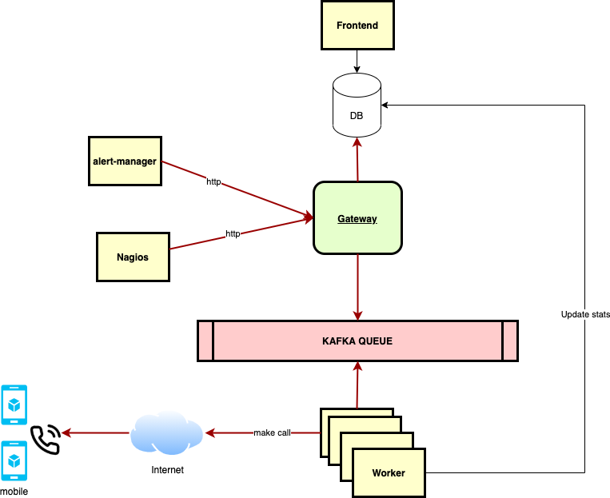

# Atuo-calling

## Feature overview
  Auto-calling Project supports NOC Monitoring Team, System Admin to notify alert 



## [Auto-calling-worker](https://github.com/auto-calling/worker)
  Gateway receive REST API HTTP request from Nagios, Alert-manager, send message to queue and insert data to database

## [Auto-calling-gateway](https://github.com/auto-calling/gateway)
  Worker receive message from queue, make call and update data to database

## Queue
  Pub-sub system queue, using Kafka to high availability

## Telegram
  - Connect to Telegram via [Pyrogram](https://docs.pyrogram.org/index.html)
  - Requirement a User Telegram Account, not a Telegram Bot 
## Issue
### With Telegram
  - ```FloodWait``` from Telegram
  - ```sqlite3.OperationalError``` database is locked when ussing same session more than one process
  - [More detail](https://docs.pyrogram.org/faq)